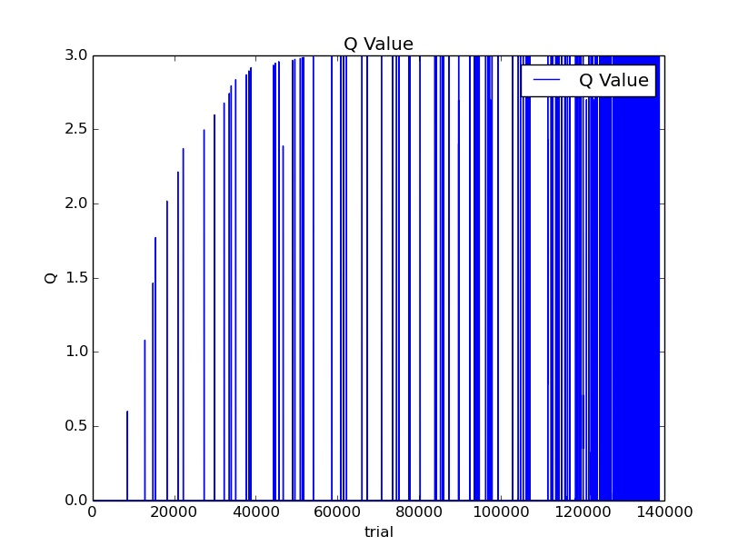

 ProbablisticRobotics2016
=================

### 問題
強化学習による迷路探索．デフォルトでは10×15マスの迷路を探索する．

  

### ルール
 - 赤い四角がエージェントであり，白いマスが通れる経路，青いマスが通れるが報酬がマイナスとなる経路(ペナルティ)，黄色いマスがゴール．  
 - ゴールに到達すると報酬が与えられる．エージェントはなるべく報酬がマイナスとなる経路を避けつつ，ゴールを目指しながら報酬が最大となるような経路を探索する．  
 - Q-Learningによる学習．学習率は0.2，割引率は0.9とした．  
 - 行動選択はε-greedy法．  

### ソフトウェア
 - main.py  
  - メインコード．  
 - map_display.py  
  - pygameによる可視化．  
 - QLearning.py
  - QLearningによる行動学習  
 - data/map.csv  
  - 各セルの報酬情報.  

### 仕様
300回ゴールしたら学習を終了，最適方策を可視化したものをpolicy.jpgという画像で保存．各マスの矢印は最適な行動を示し，各セルのQ値の大きさによってマスの色が変わる(Q値が大きいほど赤色になる．Q値がゼロの場合は変化なし)．  

### 結果
最終的に得られた方策．  

  

Q値の変化1試行毎のQ値の最大値をプロットした．一回のマスの移動を1試行とする．下図でQ値が跳ね上がっている部分はゴールに到達した場合であり，試行回数が増えるにつれてQ値の値が大きくなり，ゴールに到達する頻度が増えていくことがわかる．  

  

### おまけ
data/map.csvをいじれば何×何でも探索可能．ただマスが増えると収束させるために試行回数をより増やす必要がある．

#### 20×30の場合
  

#### 100×100の場合(計算終わる気がしなかった)
  
